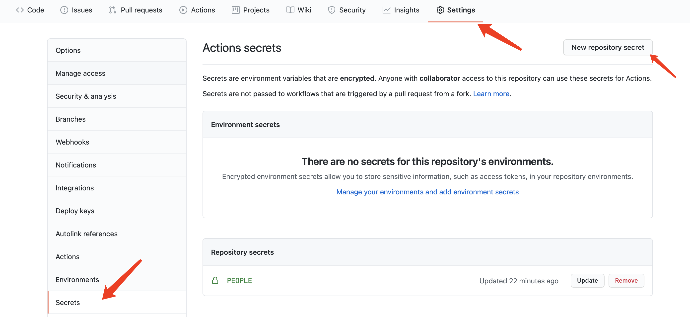

# HEALTHY_AUTO

>某公司健康打卡自动脚本
>
>稳定运行一年的python脚本，顶不住各位白嫖党的压力，开源了
>
>如果看到这行字的时候还是不想动手的话，联系我~~免费~~帮你打卡。
>
>[项目 GitHub 地址](https://github.com/adil-zhang/healthy_auto)

## 功能介绍
1. 输入用户名即可打卡，用户名一般为公司+个人名称。
2. 执行自动打卡，并返回结果。
3. 使用 GitHub Actions 挂脚本


## 使用介绍

### 安装依赖
```shell
pip install requests
```
### 执行脚本

脚本使用命令行参数输入变量，其中有且仅有一个参数-用户名。
```shell
# python action.py -h 查看usage
sage: health.py [-h] [-s [PEOPLE [PEOPLE ...]]]

optional arguments:
  -h, --help            show this help message and exit
  -s [PEOPLE [PEOPLE ...]]
                        people name of the NAME list
```
执行结果


## GitHub Actions 部署

### 1. Fork 该仓库

### 2. 创建 Secrets

 - 创建PEOPLE(必填)
 > 如果要多个用户，创建Secrets时可以多写几个，其中用空格 空格 空格 隔开即可！
 >
 
### 3. 启用 Action

点击 Actions，选择 **I understand my workflows, go ahead and enable them**

**由于 GitHub Actions 的限制，直接 fork 来的仓库不会自动执行！！！**

必须手动修改项目提交上去，最简单的方法就是修改 README.md 文件（右侧有网页端编辑按钮）。
随便修改什么都行，修改完 commit 就可以了。
之后**每天 8 点左右**会自动执行一次脚本

### 4. 手动执行

GitHub 现在有了手动执行的功能，点击下图 Run workflow 即可。

## 注意事项

- 每天打卡有效时间为6:00-17:00，其余时间无效。
- fork完之后一定要手动修改一遍，不然不会自动执行。
- 为了方便他人学习研究，脚本保留了请求内容，方便大家做修改
